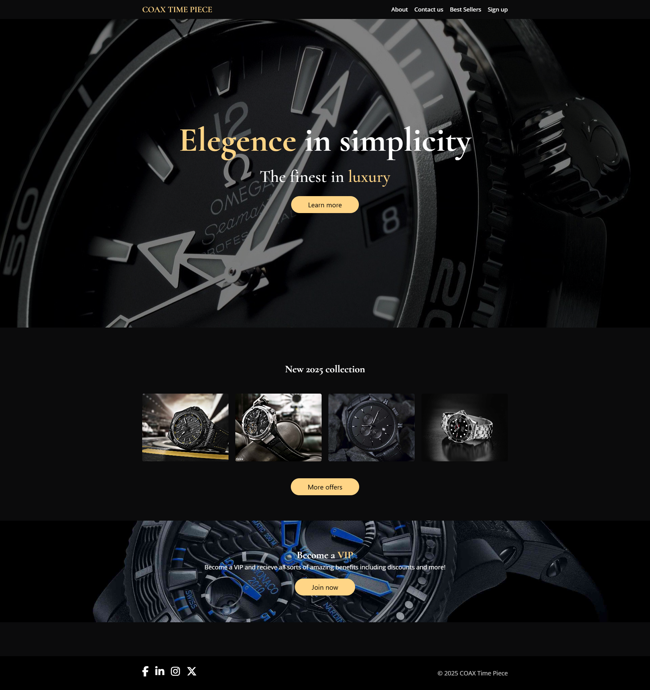
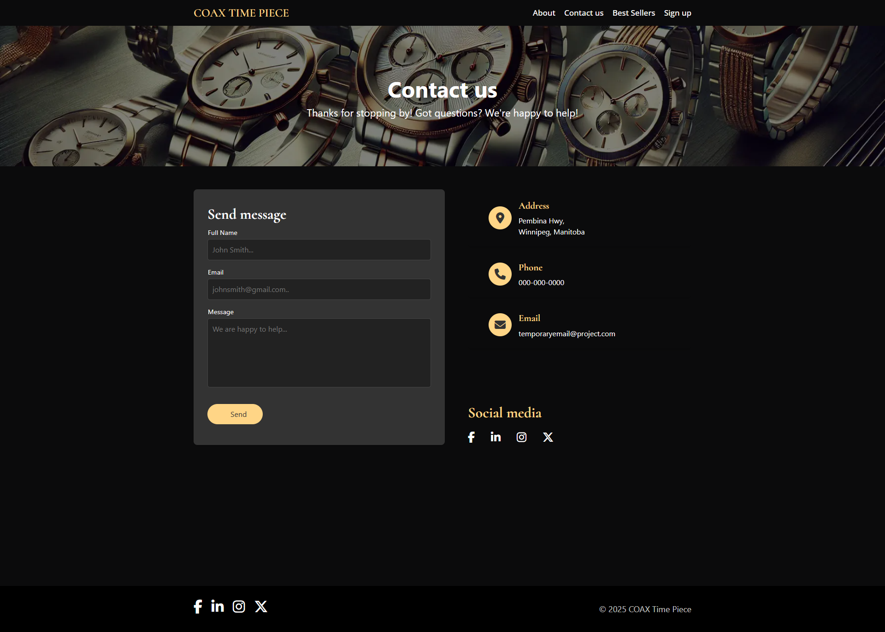

## COAX Time Piece

This is an example of an website for a luxury watch company. 
It showcases professional use of various web development techniques.
This website was made ready with a landing page, about page, contact 
page and product listing page. All pages have been made with responsivness 
built in to be able to function on a wide variety of screens making 
it ideal to be used as a template if needed.

Features:
- Responive design able to fit a variety of screen sizes.
- Professionally designed Landing, about, contact, and product listing pages.
- Organized code that is easy to read and edit.

This website was made with HTML and CSS on Visual Studio Editor.
Many of the photos were edited using Photoscape X.  
Fonts used: Open Sans, Cormorant